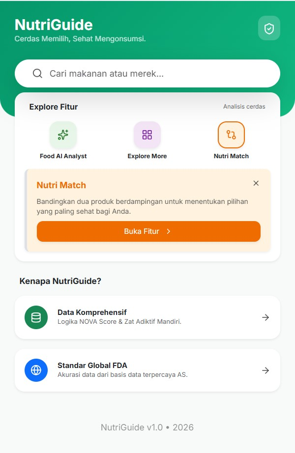
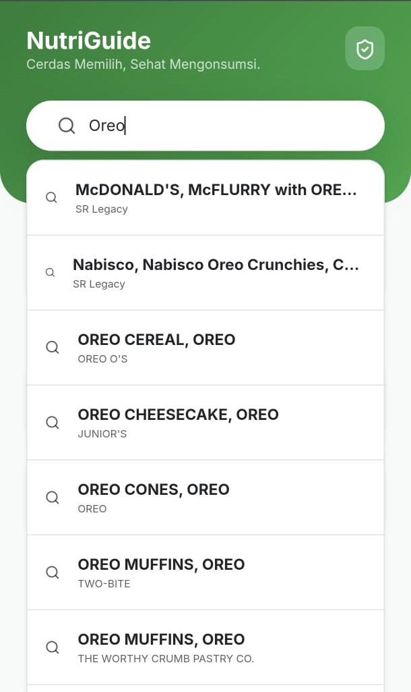
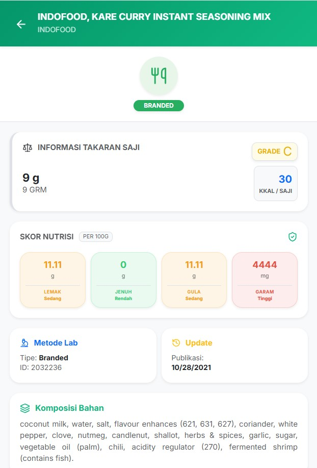
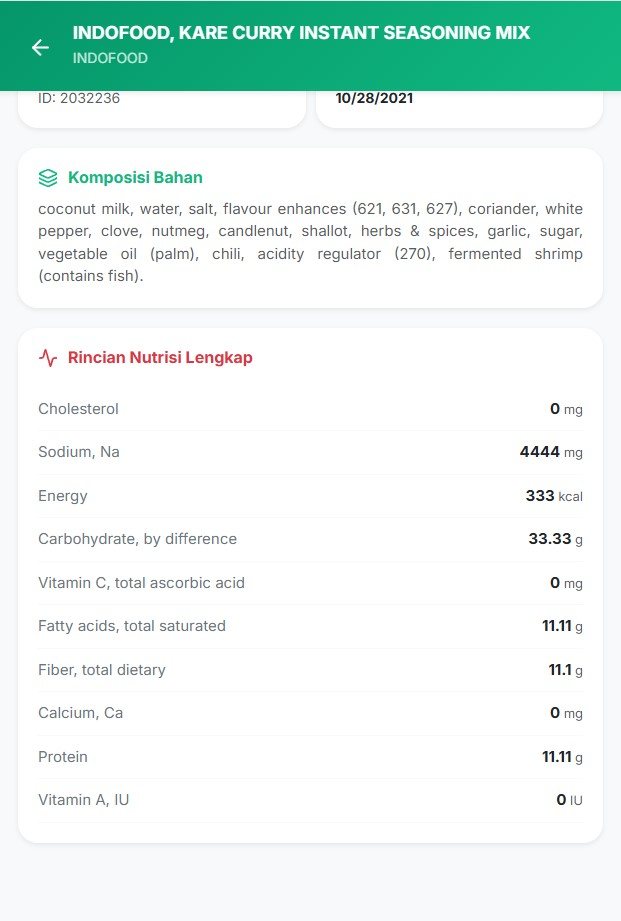
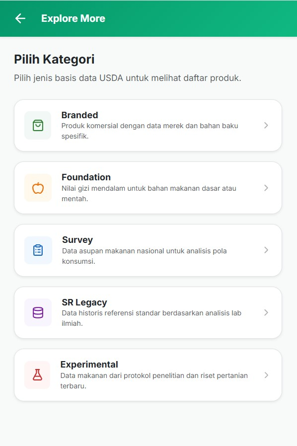
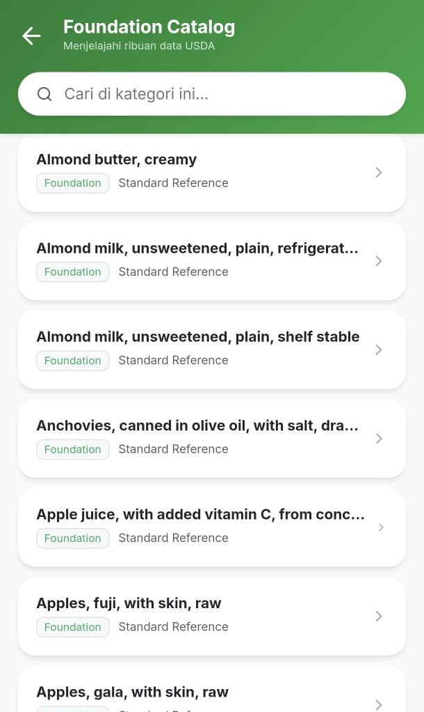

# 🌿 NutriGuide  
## Cerdas Memilih, Sehat Mengonsumsi

**NutriGuide** adalah platform inovatif yang dirancang untuk membantu Ahli Gizi di Indonesia dalam mengedukasi masyarakat mengenai konsumsi produk pangan olahan instan.  

Melalui integrasi basis data terbuka **Open US FDA** dan kecerdasan buatan (AI) dari **Google Gemini 2.5 Flash**, aplikasi ini mentransformasi label gizi yang kompleks menjadi wawasan kesehatan yang mudah dipahami.

---

## 📸 Screenshot Aplikasi

<table align="center">
  <tr>
    <td></td>
    <td></td>
    <td></td>
  </tr>
  <tr>
    <td></td>
    <td></td>
    <td></td>
  </tr>
  <tr>
    <td></td>
    <td></td>
    <td></td> <!-- Kolom kosong agar tetap rapi -->
  </tr>
</table>

---

## 📖 Latar Belakang & Motivasi


Meningkatnya angka Penyakit Tidak Menular (PTM) seperti diabetes dan hipertensi di Indonesia berkaitan erat dengan pola makan produk instan yang tinggi GGL (Gula, Garam, Lemak).

**NutriGuide hadir untuk:**

- 🧠 **Menjembatani Celah Edukasi**  
  Memberikan alat bantu bagi Ahli Gizi untuk konseling yang lebih visual dan data-driven.  

- 📊 **Transparansi Gizi**  
  Memanfaatkan ribuan data produk dari OpenFoodFacts untuk membedah kandungan nutrisi secara objektif.  

- 💡 **Literasi Digital**  
  Mengubah cara masyarakat berinteraksi dengan label nutrisi kemasan melalui bantuan AI.

- 📚 **Rencana Penelitian**  
  [Mengubah cara masyarakat berinteraksi dengan label nutrisi kemasan melalui bantuan AI.](https://docs.google.com/document/d/1nOc99xIppPzFxJ-WkiZKNzPdCZ9BSGIHaOG4N0D46Pc/edit?tab=t.0#heading=h.il6rbtd37bse)

---

## ✨ Fitur Utama

- 🔍 **Pencarian Cepat**  
  Akses instan ke basis data produk pangan lokal (Indonesia) dan internasional.

- 🧪 **AI Nutrition Consultant**  
  - Skor kesehatan (1–10)  
  - Evaluasi GGL  
  - Dampak konsumsi jangka panjang  
  - Rekomendasi alternatif lebih sehat  

- 🚦 **Traffic Light System**  
  - 🟢 Rendah  
  - 🟡 Sedang  
  - 🔴 Tinggi  

- 📱 **Mobile-First Design**  
  Antarmuka responsif dan ringan, dirancang untuk penggunaan langsung di supermarket atau ruang konseling.

---

## 🛠️ Arsitektur Teknologi

| Layer | Teknologi |
|-------|-----------|
| Frontend | React.js + NextJS |
| UI Framework | Bootstrap 5 & Lucide Icons |
| Database API | Open US FDA |
| AI Engine | Google Gemini 2.5 Flash |

---

## 🚀 Cara Menjalankan Secara Lokal

### 1️⃣ Clone Repository

```bash
git clone https://github.com/username/nutriguide.git
cd nutriguide

